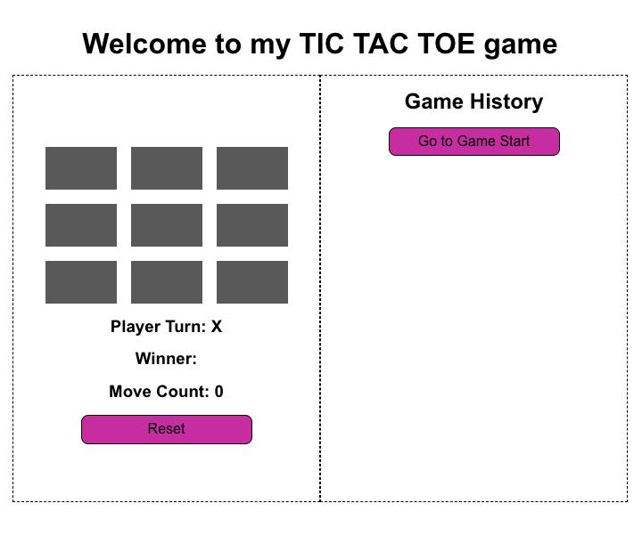

# Tic Tac Toe Game

This project is a simple Tic Tac Toe game that demonstrates basic concepts of React, such as functional components, state management, and more.

## Features

- **Functional Components**: Utilizes React functional components for building the UI.
- **State Management**: Manages game state using React's `useState` hook.
- **Game Logic**: Implements core game logic, including move handling, win condition checking, and draw detection.
- **Game History**: Tracks and allows navigation through the history of game states.
- **Reset Functionality**: Provides a reset button to restart the game.
- **Player Turn Indicator**: Displays the current player's turn.
- **Move Count**: Shows the number of moves made in the game.
- **Read-Only Previous States**: Prevents changes to previous game states, ensuring only the latest state can be modified.

## Getting Started

### Live URL

https://guptaujjwal1128.github.io/tic-tac-toe-react-app/

### Screenshot



### Prerequisites

- Node.js
- npm or yarn

### Tech Stack
- React Library
- Typescript
- Sass
- Vite as Module bundler

### Installation

1. Clone the repository:
   ```sh
   git clone https://github.com/your-username/tic-tac-toe.git
   cd tic-tac-toe

2. Install the dependencies:
    ```sh
      npm install
        # or
      yarn install
   ```

### Running the Application

1. Start the development server:
    ```sh
    npm run dev
    # or
    yarn dev
    ```

2. Open your browser and navigate to http://localhost:5173 to see the application in action.

### Building for Production

1. To build the application for production, run:

    ```sh
    Copy
    npm run build
    # or
    yarn build
    ```

### Linting

1. To check the codebase for potential errors and style issues, run:

    ```sh
    Copy
    npm run lint
    # or
    yarn lint
    ```

### Project Structure

 - src/components: Contains the React components used in the application.
 - src/helpers: Contains helper functions for game logic.
 - src/types: Contains TypeScript type definitions for the game.

### Contributing

Contributions are welcome! Please open an issue or submit a pull request for any changes.

### License

This project is licensed under the MIT License.